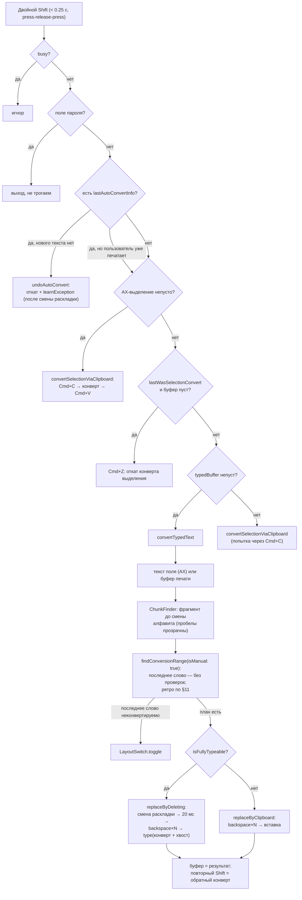
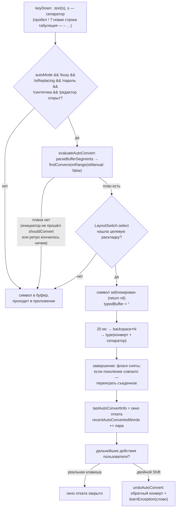
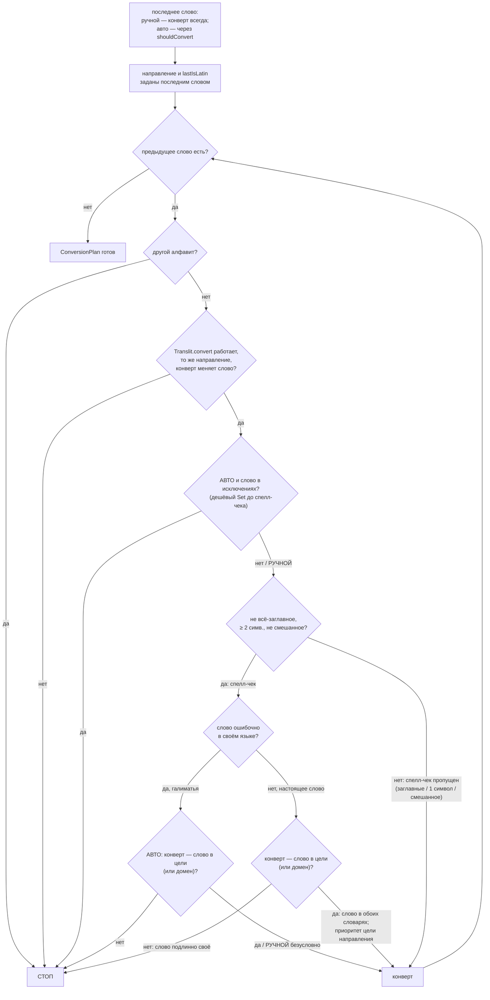
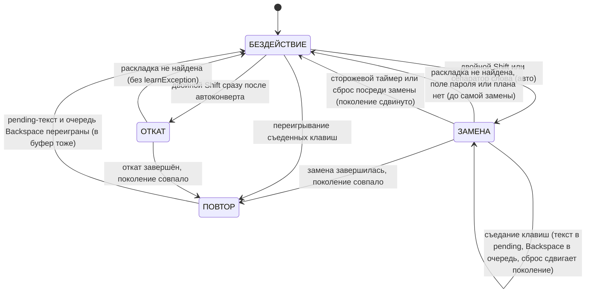

# AliSwitcher — Бизнес-логика конвертации

> **Статус**: актуальный справочник логики (истина — код, документ описывает его по фактам)
> **Дата**: 2026-09-11, код по коммиту `74d2263`
> **Область**: автоконверт на границе слова, ручной двойной Shift, выбор диапазона,
> откат, словари/исключения, состояние, клавиатурный движок
> **Исходники**: `main.swift` (handle, tryAutoConvert, performSwitch, undoAutoConvert,
> convertSelectionViaClipboard, convertTypedText, replaceByDeleting, replaceByClipboard,
> trackTypedAction, replayPendingKeystrokes, triggerSwitch),
> `AutoSwitcher.swift` (findConversionRange, shouldConvert, evaluateAutoConvert,
> parseBufferSegments, builtins, exceptions), `Translit.swift` (перевод символ в символ
> и определение направления), `ChunkFinder.swift` (начало фрагмента),
> `KeyTracker.swift` (декодирование клавиш), `KeyEvents.swift` (синтетические клавиши),
> `SwitcherState.swift` (состояние), `LayoutSwitch.swift` (переключение раскладки),
> `Accessibility.swift` (чтение текста и выделения), `Clipboard.swift` (сохранение/восстановление буфера обмена)

Имена функций и файлов — в коде как есть. «Слово-инициатор» — последнее слово
буфера печати; по нему определяется направление конвертации. «Ретро» (сокращение
от «ретроспективный») — обход слов ПЕРЕД словом-инициатором. «Сепаратор» —
символ-разделитель слова (пробел и прочие знаки из списка `boundaries`, §6.1).

---

## Содержание

1. [Общая картина: два конвейера](#1-общая-картина)
2. [Слой событий: handle() — все проверки по порядку](#2-слой-событий)
3. [Декодирование клавиш: KeyTracker](#3-keytracker)
4. [Буферизация: trackTypedAction](#4-буферизация)
5. [Опознание двойного Shift](#5-двойной-shift)
6. [Автоконверт: tryAutoConvert](#6-автоконверт)
7. [Ручной запуск: performSwitch — порядок приоритетов](#7-performswitch)
8. [Конверт набранного: convertTypedText + ChunkFinder](#8-converttypedtext)
9. [Ядро: findConversionRange — выбор диапазона](#9-findconversionrange)
10. [shouldConvert — фильтры слова-инициатора (только авто)](#10-shouldconvert)
11. [Обход предыдущих слов (ретро)](#11-ретро)
12. [Конверт выделения через буфер обмена](#12-выделение)
13. [Откат автоконверта: undoAutoConvert](#13-откат)
14. [Клавиатурный движок замены](#14-движок)
15. [Состояние (SwitcherState)](#15-состояние)
16. [Словари: встроенные слова и выученные исключения](#16-словари)
17. [Перевод символ в символ: карта и направление](#17-транслитерация)
18. [Различия авто и ручного режима — сводная таблица](#18-авто-и-ручной)
19. [Диаграммы](#19-диаграммы)
20. [Известные компромиссы поведения](#20-компромиссы)

---

<a name="1-общая-картина"></a>
## 1. Общая картина: два конвейера

У приложения два способа запустить конвертацию. Всё остальное — общая машинерия.

```
                    ┌──────────────────────────────┐
                    │  CGEvent Tap (keyDown/flags) │
                    └──────────────┬───────────────┘
                                   │
              ┌────────────────────┼────────────────────────┐
              │                    │                        │
     [АВТО] сепаратор слова  [БУФЕР] клавиши         [РУЧНОЙ] двойной Shift
     пробел ! ? новая строка   typedBuffer ≤ 500      < 0.25 с, press–release–press
     табуляция тире …            │                        │
              ▼                  │                        ▼
      tryAutoConvert() ───да────►│                 performSwitch()
      evaluateAutoConvert()      │                  (приоритеты P0–P5)
      findConversionRange(       │                        │
        isManual: false)         │                        ▼
              │  нет ──► символ  │                буфер / выделение / откат
              │        проходит  │                 findConversionRange(
              ▼                  │                   isManual: true)
      замена: backspace×N        │                        │
      → LayoutSwitch.select      ▼                        ▼
      → type(конверт + побочный  (общий движок: replaceByDeleting / replaceByClipboard)
        символ)
```

**Основная идея (как в Punto Switcher)**: приложение не знает, «что пользователь хотел
набрать» — оно знает, **какие физические клавиши нажимались** (буфер печати
`typedBuffer`, заполняется через `UCKeyTranslate` по текущей раскладке — то есть
буквально то, что стоит на экране). По словарям и системному спелл-чекеру
приложение решает, что набор шёл не в той раскладке. Дальше: Backspace×N
(стереть набранное) → переключить раскладку (`TISSelectInputSource`) →
напечатать заново синтетическими клавишами.

---

<a name="2-слой-событий"></a>
## 2. Слой событий: `handle()` — все проверки по порядку

Event tap установлен на `flagsChanged`, `keyDown`, три вида кликов мыши
(`leftMouseDown`/`rightMouseDown`/`otherMouseDown`). Порядок проверок в
`handle()` жёсткий — каждая следующая опирается на предыдущую.
Тап создаётся в `startEventTap()`; если разрешения (Accessibility,
InputMonitoring) не выданы — повтор каждые 2 секунды, состояние отражается в меню.

### 2.0. Сторожевой таймер (выполняется ПЕРВЫМ, на каждом событии)

```
ЕСЛИ state.isReplacing:
    ЕСЛИ прошло > state.isReplacingTimeout (адаптивный — §14.4):
        — isReplacing = false, busy = false
        — pendingCharacters = "", pendingBackspaces = 0
        — generation += 1            ← все висящие колбэки становятся недействительными
        (клавиатура разблокирована; конвертация считается сорванной)
```

Зачем: если приложение-приёмник не съело синтетические клавиши и completion
не пришёл — без этого сброса клавиатура осталась бы заблокированной навсегда
(реальный инцидент, задокументирован).

### 2.1. Оживление тапа

```
ЕСЛИ тип события == tapDisabledByTimeout | tapDisabledByUserInput:
    — заново включить тап (CGEvent.tapEnable)
    — событие пропустить (return nil)
```

### 2.2. keyDown — полный порядок

```
1) state.lastShiftPress = 0
   ЛЮБОЕ нажатие клавиши сбрасывает счётчик двойного Shift.
   (Двойной Shift — строго два Shift подряд; flagsChanged других модификаторов
   — Option/Cmd/Ctrl — счётчик НЕ сбрасывают, см. §5.)

2) ЕСЛИ идёт замена (isReplacing) И клавиша НЕ наша синтетическая
   (isSynthetic: eventSourceUnixProcessID == наш PID):
       декодировать через KeyTracker.action(for:):
         .text(s)        → pendingCharacters += s; СЪЕСТЬ клавишу (return nil)
         .deleteBackward → ЕСЛИ pendingCharacters не пуст: убрать последний
                           символ из отложенного текста (съесть клавишу)
                           ИНАЧЕ: pendingBackspaces += 1 (съесть — переиграем позже,
                           в журнал пишется предупреждение)
         .reset          → pendingCharacters = "", pendingBackspaces = 0,
                           generation += 1   (клавиша ПРОХОДИТ в приложение —
                           Enter/Tab/стрелки должны работать, клавиатура
                           не должна ощущаться мёртвой)
         .ignore         → клавиша проходит в приложение (Escape, клавиши
                           функций, комбинации с Cmd — позицию каретки не меняют)
   Зачем съедать: нажатия во время 0.15–0.5 с замены попали бы в «дыру»
   между Backspace и перепечатыванием — текст разъехался бы.

3) ЕСЛИ lastWasSelectionConvert И клавиша реальная:
       lastWasSelectionConvert = false    ← первое нажатие после конверта
                                            выделения закрывает окно
                                            обратного переключения (Cmd+Z)

4) ЕСЛИ lastAutoConvertInfo != nil И клавиша реальная:
       lastAutoConvertInfo = nil          ← первое нажатие закрывает окно
                                            отката автоконверта

5) [АВТОРЕЖИМ — ворота из восьми условий, ВСЕ обязательны]:
   ЕСЛИ state.autoModeEnabled             ← тумблер в меню (хранится в UserDefaults)
   && !state.busy                         ← не идёт другая конвертация
   && !state.isReplacing                  ← не в середине замены
   && !state.secureField                  ← не поле пароля
   && !isSynthetic(event)                 ← собственные синтетические клавиши не считаются
   && !ui.anyEditorVisible                ← не открыто окно редактора списков слов
   → взять KeyTracker.action(for: event) (кэшируется для повторного использования):
     ЕСЛИ action == .text(s), s.count == 1 И AutoSwitcher.isBoundary(s):
         ЕСЛИ tryAutoConvert(boundaryChar: s) == true:
             return nil     ← ЗАБЛОКИРОВАТЬ сепаратор; он будет переигран
                              последним символом конвертируемого текста
         ИНАЧЕ:
             trackTypedAction(action)   ← сепаратор идёт в буфер и в приложение
     ИНАЧЕ:
         trackTypedAction(action)       ← обычный символ: в буфер и в приложение
   ИНАЧЕ (ворота не прошли) И !isSynthetic(event):
       trackTyping(event)               ← декодировать и в буфер (авто выключен
                                          или его ворота заблокированы)

6) Пропустить событие в приложение (return Unmanaged.passUnretained)
```

Замечания по фактам:
- Сепараторы **оседают в буфере**: после слова они становятся `gap` последнего
  сегмента (`parseBufferSegments`, §9.1) и входят в `lastGap`.
- Проверку поля пароля при первых символах фрагмента выполняет
  `trackTypedAction` (§4) — в п. 5 о нём заранее ничего не известно,
  если только флаг `secureField` не установлен ранее.

### 2.3. Клик мыши (leftMouseDown / rightMouseDown / otherMouseDown)

```
typedBuffer = ""                    ← фрагмент «потерян»: каретка могла уехать
secureField = false
lastWasSelectionConvert = false
lastAutoConvertInfo = nil
recentAutoConvertedWords — НЕ трогать    ← пары «оригинал→конверт» нужны, чтобы
                                            пользователь мог выделить результат
                                            автоконверта, дважды нажать Shift
                                            (реверс) и выучить исключение —
                                            данные должны пережить клик
```

### 2.4. flagsChanged — опознание двойного Shift

См. §5.

---

<a name="3-keytracker"></a>
## 3. Декодирование клавиш: `KeyTracker.action(for:)`

Превращает CGEvent в одно из четырёх действий. **Раскладка учитывается текущая**:
`UCKeyTranslate` по Unicode-данным активного источника ввода — в буфер попадает
то, что пользователь реально видит на экране.

| Код клавиши | Действие |
|---|---|
| 36, 76 (Return/Enter) | `.reset` — фрагмент завершён |
| 48 (Tab) | `.reset` |
| 51 (Backspace) | `.deleteBackward` |
| 53 (Escape) | `.ignore` |
| 115, 116, 119, 121 (Home/PageUp/End/PageDown) | `.reset` |
| 117 (ForwardDelete) | `.ignore` |
| 123–126 (стрелки) | `.reset` |
| зажаты Cmd или Ctrl | `.ignore` (копирование/вставка/отмена — не текст) |
| остальное | `UCKeyTranslate` → `.text(символы текущей раскладки)` |

Нюанс реализации: `UCKeyTranslate` ожидает **классические** битовые значения
модификаторов (shift=2, ctrl=4, option=8, cmd=16, alphaLock=256), а не константы
текущего SDK — с ними Shift/регистр молча игнорируются.

---

<a name="4-буферизация"></a>
## 4. Буферизация: `trackTypedAction`

`typedBuffer` — «что пользователь набрал с последнего сброса». Из него берутся
слова для автоконверта и для ручного конверта набранного (когда чтение текста
поля через систему доступности недоступно).

```
case .text(s):
    ЕСЛИ буфер пуст И secureField ещё не определён для этого фрагмента:
        secureField = Accessibility.isSecureField(Accessibility.focusedElement())
                                                        ← ОДИН раз на фрагмент
    ЕСЛИ secureField: return                          ← в полях паролей буфер не ведём
    ЕСЛИ typedBufferIsFromConversion:                 ← буфер держит результат
        typedBuffer = ""; флаг = false               ← предыдущей конвертации
                                                       (для обратного переключения).
                                                       Новый набор = новый фрагмент,
                                                       старый текст мусорить не должен
    буфер += s
    ЕСЛИ длина > 500 (kMaxBufferLength): отрезать начало (защита от переполнения)

case .deleteBackward:
    ЕСЛИ secureField: return
    ЕСЛИ typedBufferIsFromConversion:
        буфер = ""; флаг = false    ← правка конвертированного текста = буфер
                                       протух: физически стирается другое
    ИНАЧЕ ЕСЛИ буфер не пуст:
        убрать последний символ     ← Backspace укорачивает буфер синхронно

case .reset:   буфер = "", typedBufferIsFromConversion = false, secureField = false
case .ignore:  ничего
```

---

<a name="5-двойной-shift"></a>
## 5. Опознание двойного Shift

В `flagsChanged` обрабатываются только коды 56 (левый Shift) и 60 (правый).
Остальные события модификаторов просто пропускаются. Направление: `isDown` = флаг
события содержит `maskShift`.

```
ЕСЛИ нажатие (isDown):
    ЕСЛИ lastShiftPress != 0
    && now − lastShiftPress < 0.25 с (kDoubleShiftInterval)
    && lastShiftRelease > lastShiftPress:      ← между нажатиями было отпускание
        ДВОЙНОЙ SHIFT:
            — lastShiftPress = 0
            — съесть второе нажатие (return nil)
            — triggerSwitch()                  ← ручной запуск (см. §7)
    ИНАЧЕ:
        lastShiftPress = now                   ← запомнить первое нажатие
ЕСЛИ отпускание:
    lastShiftRelease = now
```

Любая другая клавиша между Shift-ами обнуляет `lastShiftPress` (§2.2 п.1).
Уточнение по фактам: в `flagsChanged` проверяется ТОЛЬКО код клавиши (56/60) —
зажатые параллельно модификаторы не мешают, т.е. Cmd+Shift и Alt+Shift тоже
регистрируются как нажатия Shift и могут образовать «двойной Shift», если
между ними не было других клавиш.

<a name="6-автоконверт"></a>
## 6. Автоконверт: `tryAutoConvert`

Запускается из `handle()` при вводе сепаратора (п.5 в §2.2). Возвращает `true`,
если конвертация начата (тогда сепаратор заблокирован), `false` — если нет
(сепаратор проходит в приложение как обычно).

### 6.1. Что считается сепаратором (`AutoSwitcher.isBoundary`)

Только **универсальные** символы — одинаковые в обеих раскладках:

```
boundaries = { " ", "!", "?", "\n", "\t", "—", "–", "…" }
isBoundary(ch) = boundaries.contains(ch) || ch.isWhitespace
```

(`isWhitespace` добавочно пропускает любые пробельные символы, например `\r`.)

Почему НЕ точка и НЕ запятая: на мак-ЙЦУКЕН `.` — это `ю`, `,` — это `б`
(БУКВЫ, клавиши с буквами). Точка внутри `htdm.` — это часть слова «ревью».
Решение «слово или набор знаков» делегировано спелл-чекеру (§10 п.12–13).

### 6.2. Пошагово (по коду `tryAutoConvert`)

```
1) Вызов приходит ТОЛЬКО из ворот п.5 (§2.2): !busy, !isReplacing и прочие
   ворота уже проверены там; дублировать их здесь не нужно.
   plan = AutoSwitcher.findConversionRange(buffer, isManual: false):
       a) сегменты = parseBufferSegments(buffer)   ← слова + промежутки (§9.1)
       b) последний сегмент непуст (защита одиночных символов — shouldConvert 4c)
       c) последнее слово обязано пройти shouldConvert (§10), предыдущие —
          ретро-обход (§11); результат nil → конвертации нет → return false
   План есть:
   toRussian = plan.direction == .toCyrillic
   fullConvertedText = plan.convertedText + boundaryChar
   (в журнал на уровне INFO пишется: буфер, конверт, направление, число слов,
    число стираний)

2) busy = true
   isReplacingTimeout = computeIsReplacingTimeout(   ← адаптивный таймаут (§14.4)
       deleteCount: plan.deleteCount, textLength: fullConvertedText.count)
   isReplacing = true; isReplacingSince = текущее время
   gen = state.generation                            ← токен для колбэков (§15)

3) ЕСЛИ !LayoutSwitch.select(toRussian):            ← целевая раскладка RU/EN (§14.6)
       busy = false; isReplacing = false; return false
       (сепаратор ПРОЙДЁТ в приложение — его никто не блокировал)

4) typedBuffer = ""                                 ← набранное сейчас сотрётся

5) пауза 20 мс (Timing.autoConvertDelay)            ← дать раскладке примениться

6) KeyEvents.backspace(count: plan.deleteCount):    ← по 8 мс на клавишу
       deleteCount = originalText.count             ← БЕЗ сепаратора: он физически
                                                       ещё не в поле
   затем KeyEvents.type(fullConvertedText, toRussian):  ← конверт + сепаратор
       (внутри type() сначала пауза 50 мс на применение раскладки, потом по 10 мс
        на символ; сепаратор переигрывается последним символом — иначе он
        остался бы на экране ДО стёртого слова)

7) По завершении (completion цепочек backspace и type):
       isReplacing = false; busy = false            ← флаги снимаются ВСЕГДА
       ЕСЛИ state.generation == gen:                ← иначе колбэк устарел —
           replayPendingKeystrokes()                   только запись результатов
           lastAutoConvertInfo = (                  ← окно отката для СЛЕДУЮЩЕГО
               original: originalText + boundaryChar,  двойного Shift (§13)
               backspaceCount: fullConvertedText.count,
               undoToRussian: !toRussian,
               triggerWord)
           recentAutoConvertedWords += (triggerWord, convertedText)  ← пара для
               отложенного обучения исключениям при реверсе выделением (§12);
               при переполнении > 20 пар (maxRecentAutoWords) старейшая удаляется
```

Обратим внимание: `isReplacing` и `busy` снимаются в completion **безусловно**,
а записи в состояние (undo-окно, пары слов, переигрывание) — только когда
поколение совпало. Это защита от протухших колбэков после сторожевого сброса
(баги #4/#5).

---

<a name="7-performswitch"></a>
## 7. Ручной запуск: `performSwitch` — порядок приоритетов

```
triggerSwitch():
    guard !busy                       ← конвертация в полёте — игнор
    busy = true
    performSwitch()                   ← асинхронно на main

performSwitch():
    сигнал в журнал: «switch: buffer «…»» (буфер, обрезанный до 24 символов)

    P0. ЕСЛИ secureField → busy = false, ВЫХОД (пароли не трогаем)

    P1. ЕСЛИ lastAutoConvertInfo != nil (недавний автоконверт):
            hasNewText = в typedBuffer есть хоть один НЕ-сепараторный символ
            ЕСЛИ hasNewText:
                lastAutoConvertInfo = nil     ← пользователь уже печатает новое —
                падение к P2                   хочет конверт, а не откат
            ИНАЧЕ:
                lastAutoConvertInfo = nil
                undoAutoConvert(info)          ← двойной Shift сразу после
                ВЫХОД                           ← автоконверта = откат (§13)

    P2. ЕСЛИ выделение через систему доступности (Accessibility.selectedText)
        НЕ пусто:
            convertSelectionViaClipboard()     ← работает даже при непустом буфере
            ВЫХОД                              ← выделенное пользователь выбрал явно

    P3. ЕСЛИ lastWasSelectionConvert И typedBuffer пуст:
            lastWasSelectionConvert = false
            KeyEvents.undo()  (Cmd+Z)          ← обратное переключение последнего
            busy = false, ВЫХОД                ← конверта выделения средствами приложения
                                                 (текст не правился — Cmd+Z вернёт)

    P4. ЕСЛИ typedBuffer не пуст:
            convertTypedText()                 ← главный путь (§8)
            ВЫХОД (движок замены сам снимет busy)

    P5. convertSelectionViaClipboard()         ← последняя попытка: достать
                                                  выделение через Cmd+C (система
                                                  доступности могла промолчать);
                                                  внутри, если конвертить нечего,
                                                  — простое переключение раскладки
```

Каждый путь сам отвечает за снятие `busy` (см. §12, §8, §13);
`defer { busy = false }` в асинхронных методах не используется — путь живёт
дольше функции.

---

<a name="8-converttypedtext"></a>
## 8. Конверт набранного: `convertTypedText` + ChunkFinder

### 8.1. Откуда берётся текст

```
ЕСЛИ система доступности даёт фокус, значение поля и позицию каретки:
    realTextBeforeCaret()   ← ВЕСЬ текст поля до каретки (точный; выделяемый
                              диапазон: location + length = позиция каретки,
                              только UTF-16 смещения)
ИНАЧЕ:
    state.typedBuffer       ← наш буфер печати (чат-клиенты, Electron и т.п.)
```

### 8.2. Граница фрагмента — `ChunkFinder.chunkStart`

Идём от каретки влево (UTF-16 кодовые единицы — позиции не плывут):

- первая встреченная БУКВА задаёт алфавит фрагмента (кириллица/латиница);
- пробелы, цифры, знаки препинания — **прозрачны** (фраза «b yfgbcfk ytcrjkmrj ckjd»
  выбирается целиком, не по словам);
- стоп: первая буква ДРУГОГО алфавита, либо `\n` / `\r` / `\t`;
- суррогатные пары (эмодзи и т.п.) пропускаются как не-буквы.

Пример: «привет ghbdtn», каретка в конце → фрагмент « ghbdtn» (с ведущим пробелом).

### 8.3. Дальше (по коду)

```
ЕСЛИ фрагмент пуст (start == caret) → LayoutSwitch.toggle(), busy = false, ВЫХОД

plan = findConversionRange(chunk, isManual: true)     ← §9
ЕСЛИ nil (последнее слово нельзя конвертировать):
    LayoutSwitch.toggle(), busy = false, ВЫХОД        ← просто смена раскладки

toRussian   = plan.direction == .toCyrillic
fullText    = plan.convertedText + plan.lastGap       ← lastGap уже в поле,
deleteCount = plan.deleteCount + lastGap.count           стираем и печатаем заново
                                                       ← ОТЛИЧИЕ от авто: там
                                                       сепаратор был заблокирован
                                                       и в deleteCount не входил
ЕСЛИ KeyEvents.isFullyTypeable(fullText, toRussian):  ← §14.3
    replaceByDeleting(fullText, deleteCount, toRussian)
ИНАЧЕ:
    replaceByClipboard(fullText, deleteCount)         ← эмодзи/диакритика/смешанные
                                                       алфавиты клавишами одной
                                                       раскладки не набрать
```

После завершения замены (оба движка, §14): `typedBuffer = fullText` (результат
конвертации вместе с хвостовым промежутком), `typedBufferIsFromConversion = true`
→ **повторный двойной Shift конвертит обратно** (обратное переключение).
Начало нового набора очищает буфер (§4).

---

<a name="9-findconversionrange"></a>
## 9. Ядро: `findConversionRange` — выбор диапазона

Общая для авто и ручного режима. Возвращает `ConversionPlan`:

| Поле | Смысл |
|---|---|
| `prefix` | текст ДО диапазона — остаётся в поле, не стирается |
| `originalText` | конвертируемые слова + промежутки МЕЖДУ ними (без хвостового) |
| `convertedText` | то же после конвертации |
| `lastGap` | сепараторы ПОСЛЕ последнего слова |
| `deleteCount` | = `originalText.count` — число Backspace |
| `direction` | `.toCyrillic` / `.toLatin` — задаётся ПОСЛЕДНИМ словом |
| `triggerWord` | последнее слово |
| `wordCount` | сколько слов затронуто (последнее + ретро) |

### 9.1. Разбиение на сегменты: `parseBufferSegments`

Буфер режется на пары (слово, промежуток). Между ними: сначала пропускаются
ведущие сепараторы, затем слово — всё до первого сепаратора, затем промежуток
(`gap`) — вся непрерывная полоса сепараторов после слова.
`"f e ghbdtn"` → `[("f"," "), ("e"," "), ("ghbdtn","")]`.

Точка, запятая, точка с запятой — НЕ сепараторы (§6.1): они остаются частью слов.
Знаки тоже часть слова — например в тестовом слове `Э"nj` кавычка `"` стоит на
клавише Shift+э; `isWordLatin` при определении алфавита смотрит на ПЕРВУЮ БУКВУ,
пропуская впереди стоящие не-буквы, иначе ретро ломалось бы на такой записи.

### 9.2. Каркас (по коду)

```
1) последний сегмент:
   ЕСЛИ сегмента нет / слово пустое / Translit.convert не даёт результата
   или не меняет слово → nil (конвертации нет)

2) ЕСЛИ режим авто (!isManual):
   guard shouldConvert(последнее слово,
                       precomputed: уже вычисленный результат Translit) != nil,
   иначе nil
   (предвычисленный результат переиспользуется — Translit.convert
    для последнего слова выполняется один раз;
    ручной режим: последнее слово конвертируется ВСЕГДА — словари не спрашиваются)

3) direction = результат Translit.convert(последнее слово).direction
   lastIsLatin = isWordLatin(последнее слово)

4) ретро-обход от предпоследнего слова к началу фрагмента — §11
   (слово-инициатор уже входит в convertedText; промежуток последнего сегмента
    — в lastGap, НЕ в convertedText)

5) построение плана:
   prefix        = слова+промежутки до `wordIndex` (не конвертируются)
   originalText  = конвертируемые слова + промежутки между ними
   convertedText = их конверты (конверт последнего слова уже положен в п.1)
   wordCount     = число сегментов от wordIndex+1 до конца
```

---

<a name="10-shouldconvert"></a>
## 10. `shouldConvert` — фильтры слова-инициатора (только авто)

Вызывается только для последнего слова при автоконверте (ретро-обход имеет
свои проверки — §11). Параметр `minLength = 1` (минимальная длина). Каждая
ступень может вернуть
`nil` = «не конвертировать». Порядок — строго как в коде. Все структурные
проверки (пп. 1–3с) читают «шейп» слова — один проход по строке (`WordShape`,
AutoSwitcher.swift); отдельно работают только `Translit.convert` и спелл-чекер.

| # | Проверка (точное условие) | Зачем | Примеры отсева |
|---|---|---|---|
| 1 | `word.count >= minLength` (=1) | пустое не рассматривается | |
| 2 | есть хоть одна буква | цифры и знаки — не слово | `123`, `!!!` |
| 3 | НЕ «всё-заглавные»: `букв > 1 && все заглавные` | аббревиатуры | `HTML`, `API` (регистр прочих слов не фильтруется: `шЗрщту`=iPhone в неверной раскладке — валидируется спелл-чекером) |
| 3b | нет цифр | код, артикулы | `iPhone15`, `3D`, `C4H8` |
| 3c | нет `_` | идентификаторы | `my_var`, `MAX_SIZE` |
| 3d | не совпадает с `nonConvertRegex` | URL, почта, IP, пути, переменные, флаги, snake_case | `https://…`, `www.`, `a@b.c`, `1.2.3.4`, `/usr`, `~/…`, `$HOME`, `-rf`, `--verbose` |
| 4 | `Translit.convert` дал результат И он отличается от оригинала | нечего конвертировать | чистая латиница в EN-раскладке не меняется |
| 4a | НЕ встроенное слово (в ретро-обходе правило другое — §11 e) | частотные коротышки, которые спелл-чекер может не знать | `the`, `is`, `что`, `она` |
| 4b | НЕ в выученных исключениях (`enWords`/`ruWords`) | пользователь уже отменял конверт этого слова | |
| 4c | ЕСЛИ слово из 1 символа: конверт — встроенное слово ЦЕЛЕВОГО языка (иначе `nil`); многосимвольное — мимо | одиночные буквы осмысленны как слова редко | `d→в ✓`, `f→а ✓`, `Ш→I ✓`; `g→п ✗`, `q→й ✗`, `ъ→] ✗` (оба направления) |
| 4d | смешанный алфавит (кириллица+латиница в одном слове) → конверт БЕЗ спелл-чекера | смешанность всегда означает смену раскладки посреди слова; спелл-чекер со смесью не работает | `Любыхk → любыхл`, `Э"nj → ЭЭто` |
| 5 | (для слов ≥ 2) `origMisspelled`: слово ошибочно в СВОЁМ языке | правильное своё слово не трогаем | `привет`, `hello` |
| 6 | `convValid`: конверт — слово в ЦЕЛЕВОМ языке (или совпадает с шаблоном домена `adguard.com` и т.п.) | конверт ради конверта не нужен | набор знаков откинут |

Примечание: для одиночных символов (шаг 4c) спелл-чекер не вызывается вовсе —
для одиночных букв он бессмыслен (считает всё «валидным»).

---

<a name="11-ретро"></a>
## 11. Ретро: обход предыдущих слов

Идея: если пользователь набрал не в той раскладке ОДНО слово — вероятно, не в
той раскладке набраны и несколько ПРЕДЫДУЩИХ (он же не заметил). Обход идёт
от слова перед инициатором к началу фрагмента, слово за словом. Направление
и целевой язык определены последним словом и НЕ меняются. Для каждого слова:

```
a) пустое слово → пропустить

b) другой алфавит (isWordLatin(prev) != lastIsLatin) → СТОП
   «привет ghbdtn» — цепочка только внутри одного алфавита

c) ЕСЛИ Translit.convert(prev) == nil
   ИЛИ направление != направлению инициатора
   ИЛИ конверт не изменил слово                          → СТОП

d) ЕСЛИ режим АВТО И слово в выученных исключениях (enWords/ruWords) → СТОП
   (в РУЧНОМ режиме исключения НЕ проверяются вовсе;
    дешёвый O(1) поиск по Set — стоит ДО спелл-чекера,
    исключённое слово не платит за системные вызовы)                  ← §20.3

e) спелл-чек-блок. Выполняется ЕСЛИ выполнены ВСЕ три
   (встроенные слова НЕ исключаются ни в каком режиме — PR #33):
     НЕ (всё-заглавное: букв > 1 и все заглавные)   ← ЕРФТЛ→THANK: спелл-чекер
     && слово ≥ 2 символов                            считает аббревиатуры валидными
     && НЕ смешанный алфавит
   Внутри блока:
       origMisspelled = слово ошибочно в СВОЁМ языке
       ├─ ДА (галиматья):
       │    АВТО   → конверт обязан быть словом в целевом (или домен);
       │              нет → СТОП
       │    РУЧНОЙ → конверт БЕЗУСЛОВНО (пользователь сам попросил)  ← см. §20.1
       └─ НЕТ (настоящее слово):
            конверт — слово в целевом? (или домен)
            ├─ ДА  → слово существует в ОБОИХ словарях → КОНВЕРТИМ
            │        (приоритет целевого языка направления:
            │         EN→RU → русское выигрывает, RU→EN → английское)
            └─ НЕТ → слово подлинно своё → СТОП
            («vs»→«мы»: оба валидны → конвертим; «by»→«ин»: «ин» не слово → стоп)

f) конверт слова → добавляется СПЕРЕДИ к convertedText → следующее слово
```

Причёсанные следствия (важно читать вместе с §20):

- **Ретро, одиночные символы** (менее 2 букв): спелл-чек-блок не выполняется
  (п. e) — одиночные конвертятся БЕЗУСЛОВНО в обоих режимах
  (`f e ghbdtn` → «а у привет» — вся фраза в неверной раскладке).
  Оборотная сторона: правильное «и» перед цепочкой превратится в «b» (§20.4).
- **Ретро, встроенные слова**: идут через спелл-чек в ОБОИХ режимах
  (авто — с PR #25, ручной — с PR #33). Настоящие русские слова «но», «все»
  останавливают обход, если их конверты не словарные в цели; конверт
  выполняется лишь по правилу «валиден в обоих словарях»
  («из»→«bp» конвертится, «это»→«'nj» — нет).
- **Исключения в ручном режиме** не блокируют ничего (§20.3).

История: PR #25 провёл встроенные слова через спелл-чек в АВТО (баг
«это из сдд» → три слова), но оставил ручному режиму обход. Ложное
срабатывание 2026-09-11 («но все штзгеы») показало, что обход вредит и там —
PR #33 убрал его: в ретро встроенное слово в обоих режимах идёт через
спелл-чек, а конверт «валидного в обоих словарях» решается общим
правилом приоритета направления.

---
<a name="12-выделение"></a>
## 12. Конверт выделения через буфер обмена

`convertSelectionViaClipboard()`. Вызывается из P2 и P5 (§7).

```
1) guard !isReplacing → busy = false, ВЫХОД     ← не в середине другой замены
2) isReplacingTimeout = 1.5 с (минимум:          ← размер замены неизвестен
   конверт через Cmd+V мгновенный)
   isReplacing = true; gen захвачен (§15)
3) beforeChange = pasteboard.changeCount
   saved = Clipboard.snapshot()                  ← сохранение ДАННЫХ, не ссылок
                                                    (NSPasteboardItem со временем
                                                    протухают — краш-урок)
4) KeyEvents.copySelection() (Cmd+C)
   пауза 150 мс (Timing.clipboardWait)
   ЕСЛИ generation != gen → isReplacing=false, busy=false, ВЫХОД (протухший колбэк)
   ЕСЛИ changeCount не изменился / строка пуста / Translit.convert не дал
   результата / конверт == оригинал:
       typedBuffer = "" (протухший буфер — прочистить)
       Clipboard.restore(saved)
       isReplacing = false; busy = false
       LayoutSwitch.toggle()                     ← нечего конвертировать —
       replayPendingKeystrokes()                    просто смена раскладки
       ВЫХОД
5) ОБУЧЕНИЕ ИСКЛЮЧЕНИЯМ: ЕСЛИ autoLearnExceptions И recentAutoConvertedWords
   не пусто: выделение и конверт обрезаются от пробелов; из recentAutoConvertedWords
   удаляются (и по ним уходит learnException) все пары, где выделение или конверт
   совпали с original ИЛИ converted пары (сравнение в обе стороны — пользователь
   реверсирует автоконверт; удаление — чтобы ОДНА пара не училась дважды)
6) lastWasSelectionConvert = true                ← вход для P3 (Cmd+Z-откат)
7) LayoutSwitch.select(по направлению конверта)
8) Clipboard.copy(конверт); KeyEvents.paste() (Cmd+V — заменяет выделение)
9) пауза 400 мс (Timing.clipboardRestore) → Clipboard.restore(saved)
10) isReplacing = false; busy = false
    ЕСЛИ generation == gen: typedBuffer = "" (протухший буфер — прочистить)
    replayPendingKeystrokes()
```

Спелл-чекер здесь НЕ вызывается: пользователь выделил текст явно — конвертим
напрямую через `Translit.convert`, без всяких проверок (встроенные слова,
исключения, проверка словарём — не участвуют).

---

<a name="13-откат"></a>
## 13. Откат автоконверта: `undoAutoConvert`

Срабатывает по P1 из §7: двойной Shift **сразу после** автоконверта, пока
пользователь не успел ничего напечатать (`lastAutoConvertInfo != nil` и в буфере
нет не-сепараторных символов — любой реальный keyDown стирает окно, §2.2 п.4).

```
1) ЕСЛИ !LayoutSwitch.select(undoToRussian):
       busy = false, ВЫХОД                     ← раскладку не нашли — откат
                                                  не состоится, ИСКЛЮЧЕНИЕ НЕ УЧИТСЯ
                                                  (баг #3: обучение — после этого guard'а)
2) ЕСЛИ autoLearnExceptions (тумблер в меню, по умолчанию ВКЛ):
       learnException(triggerWord)             ← слово по алфавиту уходит в
                                                  enWords или ruWords; выученное
                                                  слово больше НЕ автоконвертится
                                                  (обучение происходит СРАЗУ,
                                                  до фактического стирания/набора)
3) isReplacingTimeout = computeIsReplacingTimeout(
       deleteCount: info.backspaceCount, textLength: original.count)
   isReplacing = true; gen захвачен; typedBuffer = ""
4) пауза 50 мс (Timing.layoutSwitchDelay)
5) backspace(backspaceCount) → type(original, undoToRussian)
   (backspaceCount = длина конверта+сепаратор, откат возвращает оригинал+сепаратор,
    набор идёт в прежней раскладке)
6) completion: isReplacing = false; busy = false (безусловно);
   ЕСЛИ generation == gen: replayPendingKeystrokes()
```

Обучение срабатывает и через реверс выделением (§12 п.5) — там проверяются
`recentAutoConvertedWords` (компенсация: между автоконвертом и реверсом
пользователь мог кликнуть мышью, а клик стирает `lastAutoConvertInfo`).
Выученное вручную (в ручном режиме конвертации) ничего НЕ учит — только откат.

---

<a name="14-движок"></a>
## 14. Клавиатурный движок замены

### 14.1. `replaceByDeleting` — основной путь

```
1) guard !isReplacing → busy = false, ВЫХОД
2) ЕСЛИ !LayoutSwitch.select(toRussian): busy = false, ВЫХОД (текст не трогаем)
3) адаптивный таймаут (§14.4); isReplacing = true; gen захвачен
4) пауза 20 мс (Timing.autoConvertDelay)          ← PR #26: без неё первый
                                                     Backspace терялся
                                                     (Spotlight и системные поля);
                                                     протухший колбэк (ген не совпал)
                                                     → тихий выход
5) backspace(deleteCount) — по 8 мс на клавишу
6) журнал: «deleted N, typing «…»»
   type(text):
   - пауза 50 мс (Timing.layoutSwitchDelay) — дать раскладке примениться
   - по 10 мс на символ
   - для toRussian: символ → исходная QWERTY-клавиша через Translit.enOnSameKey,
     если клавиши нет — запись в журнал, символ пропускается
7) completion: isReplacing = false; busy = false (безусловно);
   ЕСЛИ generation == gen:
       typedBuffer = text; typedBufferIsFromConversion = true  ← обратное переключение
       lastWasSelectionConvert = false
       replayPendingKeystrokes()
```

### 14.2. `replaceByClipboard` — когда клавишами не набрать

```
1) guard !isReplacing → busy = false, ВЫХОД
2) адаптивный таймаут (§14.4); isReplacing = true; gen захвачен;
   snapshot буфера обмена
3) backspace(deleteCount) → журнал → Clipboard.copy(text) → KeyEvents.paste()
4) пауза 400 мс → Clipboard.restore(saved)
5) isReplacing = false; busy = false (безусловно)
6) ЕСЛИ generation == gen: typedBuffer = text,
   typedBufferIsFromConversion = true, lastWasSelectionConvert = false,
   replayPendingKeystrokes()
```

Применяется при смешанных алфавитах/эмодзи: `isFullyTypeable` = false.

### 14.3. `KeyEvents.isFullyTypeable` — можно ли набрать клавишами

Проверяет каждый символ `fullText`:

- буква при `toRussian`: должна быть кириллицей, у которой `Translit.enOnSameKey`
  находит QWERTY-клавишу; латинская буква в русском тексте → false
  (в русской раскладке нажатие «h» даст «р», не «h»);
- буква при `toLatin`: должна быть латиницей и иметь QWERTY-клавишу;
  кириллица в английском тексте → false;
- НЕ-буква (пробел, цифра, знак): должна быть в QWERTY-карте; эмодзи и
  необычные знаки → false.

### 14.4. Адаптивный таймаут `computeIsReplacingTimeout`

```
expected = deleteCount × 8 мс + textLength × 10 мс + 50 мс (раскладка)
timeout  = max(1.5 с (minIsReplacingTimeout), expected + 0.5 с)
```

Малые конверты — 1.5 с; крупные (96 Backspace + 90 символов ≈ 1.67 с) —
пропорциональный запас + 0.5 с. Инцидент: фиксированные 1.5 с срывали крупный
конверт сторожевым сбросом посреди замены.

### 14.5. `replayPendingKeystrokes` — переиграть съеденное

Клавиши, съеденные во время замены (§2.2 п.2): сначала отложенный текст
(`pendingCharacters` — через `KeyEvents.replay`, БЕЗ стартовой паузы:
раскладка уже применена; направление по первому символу текста), затем
Backspace-ы (`pendingBackspaces`). Переигранное попадает и в буфер
(`trackTypedAction`), чтобы следующие проверки видели актуальный набор.

### 14.6. `LayoutSwitch.select` — как ищется раскладка

```
1) список источников кэшируется (loadSources нужен только при первом
   обращении и после неудачи: пользователь мог править раскладки);
2) точные ID (нижний регистр):
   в русскую: com.apple.keylayout.Russian, Russian-PC, RussianWin
   в английскую: com.apple.keylayout.US, ABC, ABC-AZERTY
3) эвристика:
   русская: ID содержит "russian"
   английская: ID содержит ".us"/"abc" ИЛИ имя содержит "english"
4) полный провал → кэш обновляется и вторая попытка; снова провал → false
   (вызывающий код отказывается от конвертации)

toggle(): текущая (по ID) russian/belarusian/ukrainian → в английскую, иначе
в русскую.
```

---

<a name="15-состояние"></a>
## 15. Состояние (SwitcherState)

| Поле | Тип | Кто пишет | Смысл |
|---|---|---|---|
| `busy` | Bool | все пути | одна конвертация одновременно; сброс в КАЖДОМ выходе, включая сторожевой |
| `isReplacing` (+`Since`, +`Timeout`) | Bool/время | движок замены | идёт цепочка backspace/type; сторожевой таймер следит за таймаутом; каждое переключение логируется |
| `typedBuffer` | String ≤ 500 | trackTypedAction | набранный фрагмент |
| `typedBufferIsFromConversion` | Bool | движок | буфер = результат конверта (для обратного переключения); новый набор и Backspace чистят |
| `generation` | UInt64 (+1 переполнение безопасно) | сторожевой сброс, `.reset` при замене | токен асинхронности: колбэк сверяет своё поколение; несовпавший — не пишет результат (баги #4/#5) |
| `pendingCharacters` / `pendingBackspaces` | String/Int | handle при isReplacing | съеденные клавиши → §14.5 |
| `lastAutoConvertInfo` | (original, backspaceCount, undoToRussian, triggerWord)? | автоконверт | окно отката; стирается ЛЮБЫМ реальным keyDown (§2.2 п.4) или кликом мыши |
| `recentAutoConvertedWords` | [(original, converted)] ≤ 20 | автоконверт | пары для обучения при реверсе выделением; переживают клик |
| `lastWasSelectionConvert` | Bool | §12 | окно Cmd+Z-отката выделения |
| `secureField` | Bool | trackTypedAction, клики | пароли: не буферизуем, не конвертим |
| `autoModeEnabled` | Bool (UserDefaults) | меню | тумблер авто |
| `autoLearnExceptions` | Bool (UserDefaults), начальное true | меню | обучение на откате |
| `enWords` / `ruWords` | Set<String> (lowercase) | learnException, редакторы списков | исключения: маршрут по алфавиту слова |
| `lastShiftPress` / `lastShiftRelease` | время | §5 | опознание двойного Shift |
| `tapActive`, `tapRetryTimer` | Bool/Timer | startEventTap | разрешения не выданы — повтор каждые 2 с |

Правило `busy`: НЕЛЬЗЯ `defer { busy = false }` — асинхронные пути живут дольше
функции (инцидент с застрявшим переключением задокументирован).

---

<a name="16-словари"></a>
## 16. Словари: встроенные слова и выученные исключения

### Встроенные (bundle)

`builtin_words_en.txt` (108 слов) и `builtin_words_ru.txt` (81 слово) в ресурсах
приложения: частотные слова 1–3 символов. Читаются при старте через
`Bundle.main`; файла нет (запуск без бандла) → пустое множество и запись в журнал.
Формат: одно слово в строке, строки с `#` — комментарии. `isBuiltinWord` перед
поиском приводит слово к нижнему регистру (регистр не важен) и выбирает список
по алфавиту слова (`isWordLatin` — по ПЕРВОЙ БУКВЕ, не-буквы и пунктуация в
начале пропускаются). **Не хардкодить в Swift** — только txt-файлы.

Применение:
- авто-инициатор: шаг 4a — блокирует конверт (§10);
- авто-инициатор из одного символа: шаг 4c — РЕЗУЛЬТАТ должен быть встроенным;
- ретро: идут через спелл-чек в обоих режимах (§11 e); обход в ручном
  режиме убран PR #33 — был причиной ложного срабатывания 2026-09-11 (§20.1);
- ретро, одиночные символы: результата их конверта требуется встроенность в АВТО-инициаторе;
  в самом ретро — не требуется (§20.4).

### Исключения (выученные)

Два независимых `Set<String>`: `enWords` (латиница → блокирует ЛАТИНИЦА→РУССКИЙ)
и `ruWords` (кириллица → блокирует РУССКИЙ→ЛАТИНИЦА). Направление неявное —
из алфавита слова. Пары «оригинал↔перевод», словаря и обратного блокирования —
НЕТ. Хранятся в UserDefaults как два массива строк, их содержимое загружается
и сохраняется полностью (`saveLearnedWords`). Есть миграция старых форматов
(`learnedWords`, `learnedPairs`, `autoExceptions`, `customDictionary`) в два
новых списка — старые слова становятся исключениями.

Пишутся при: `undoAutoConvert` (откатный двойной Shift, при включённом
`autoLearnExceptions`, ПОСЛЕ успешного `LayoutSwitch.select` — баг #3) и при
реверсе автоконверта выделением (§12 п.5). `learnException` всегда приводит
слово к нижнему регистру.
**Ручной режим исключения не проверяет вообще** (§11 d).

<a name="17-транслитерация"></a>
## 17. Перевод символ в символ: карта и направление

`Translit.ruToEn` — соответствие «русская буква ↔ символ на той же физической
клавише». Буквы совпадают с Windows ЙЦУКЕН. **Знаки — МАК-карта**
(`com.apple.keylayout.Russian`, проверено дампом `UCKeyTranslate`, PR #28):

| RU | EN | клавиша |
|---|---|---|
| `№` | `#` | Shift+3 |
| `"` | `@` | Shift+2 |
| `%` | `$` | Shift+4 |
| `:` | `%` | Shift+5 |
| `,` | `^` | Shift+6 |
| `.` | `&` | Shift+7 |
| `;` | `*` | Shift+8 |
| `?` | `?` | Shift+44 — универсальна |
| `/` | `/` | 44 — универсальна |

(`б/ю` на нижнем ряду: `б`→`,`, `ю`→`.` — как в Windows; `ё` на клавише `\`:
`ё`→`\`, `Ё`→`|` — ISO-мак.)

`Translit.convert(text)` — по шагам:

1. **Нормализуются типографские кавычки** — только ЕСЛИ в тексте есть
   `\u{201C} \u{201D} \u{2018} \u{2019}` (замена Smart Quotes в macOS):
   `“”`→`"`, `‘’`→`'`. Без этого они не находятся в карте и ломают конверт.
2. Считаются кириллические и латинские буквы.
3. **Букв нет вообще** — но есть знаки из карт: первый найденный знак решает
   направление (латинский знак `[`/`'`/`;`/`\` → конверт всего текста в
   кириллицу; русский знак `.` и др. → в латиницу); ничего из карт → nil.
4. **Смешанное слово** (кириллица+латиница): первая БУКВА задаёт «правильную»
   раскладку — конвертируется меньшинство: «любыхk» → «любыхл» (первая «л»
   кириллица → направление «в русскую», k-хвост переводится в «л»;
   НЕ «любых» → «k.,s[»).
5. **Чистое слово** → в противоположный алфавит (кириллица → латиница и т.д.).
   Чистая ЛАТИНИЦА возвращает текст без изменений — вызывающие коды обязаны
   отбрасывать неизменённые результаты (все проверяют `converted != word`).

---

<a name="18-авто-и-ручной"></a>
## 18. Различия авто и ручного режима — сводная таблица

| Аспект | Автоконверт (сепаратор слова) | Ручной (двойной Shift) |
|---|---|---|
| Ворота | 8 условий handle() (§2.2 п.5) | busy + рисунок Shift-нажатий (§5) |
| Вход в findConversionRange | `isManual: false` | `isManual: true` |
| Последнее слово | проходит 13 фильтров `shouldConvert` (§10) | конвертируется ВСЕГДА, без проверок |
| Инициатор из одного символа | только если конверт — встроенное слово | без ограничений |
| Ретро: «галиматья» (origMisspelled) | конверт обязан быть словом в цели | конверт безусловно |
| Ретро: встроенное слово | через спелл-чек | через спелл-чек (PR #33) |
| Ретро: одиночные символы | конверт безусловно | конверт безусловно (§20.4) |
| Ретро: выученные исключения | блокируют | НЕ проверяются (§20.3) |
| Сепаратор после слова | заблокирован и переигрывается в тексте | уже в поле: входит в deleteCount и fullText |
| Откат | следующий двойной Shift = откат (`lastAutoConvertInfo`) | повторный двойной Shift = обратный конверт (буфер), для выделения — Cmd+Z |
| Обучение исключениям | да (откат / реверс выделением) | НЕТ (ручной конверт ничего не учит) |
| Выделение | не участвует | P2: система доступности → буфер обмена; P3: Cmd+Z-откат |
| Спелл-чек вообще | да | в ретро — только для «настоящих» слов; у инициатора НЕТ |
| Если конвертить нечего | сепаратор просто проходит | LayoutSwitch.toggle() |

---

<a name="19-диаграммы"></a>
## 19. Диаграммы

### 19.1. Ручной двойной Shift (performSwitch + convertTypedText)



### 19.2. Автоконверт



### 19.3. Ретро (внутри findConversionRange)



### 19.4. Состояния (обновлённая версия наполнения Appendix A из DESIGN-conversion-logic.md)




---

<a name="20-компромиссы"></a>
## 20. Известные компромиссы поведения

### 20.1. Ручной ретро портит правильные слова: заимствования

**Симптом 1** (2026-09-06, журнал): пользователь набрал «…можно репозиторий» верно
по-русски, затем хотел «find», но не переключил раскладку → «аштв». Двойной Shift
починил «аштв»→«find», но заодно исказил правильное «репозиторий» → «htgjpbnjhbq».
Причина: системный словарь НЕ знает «репозиторий» (проверено NSSpellChecker:
misspelled = true; аналогично «коммит», «деплой», «инпуте»). В ручном ретро
«галиматья в своём языке» конвертится безусловно (§11 e), исключения игнорируются.

**Симптом 2 — ИСПРАВЛЕН** (2026-09-11 12:31, журнал; фикс PR #33): буфер
«смотри, вот в рамках этого … но все штзгеы» («штзгеы» = «inputs», набранное
в русской раскладке). Двойной Shift RU→EN должен был заменить только
«штзгеы»→«inputs», но удалил 13 символов и вбил «yt dct inputs»: «но все» —
встроенные слова (§16), а в ручном ретро встроенное тогда обходило спелл-чек.
Сейчас встроенное в обоих режимах идёт через спелл-чек — конвертится только
инициатор (регрессионный тест «но все штзгеы» manual → «inputs» only).

**Обсуждаемые варианты для симптома 1** (решение по состоянию на 2026-09-11 НЕ принято):
1. Требовать `convValid` для «галиматьи» и в ручном — спасает заимствования
   сразу, но цепочка стопится на «мусорных» словах (частичный фикс фразы).
2. Только уважение исключений в ручном + обучение на откате ручного конверта —
   мягче, но каждое НОВОЕ слово всё равно портится при первом же попадании.

### 20.2. Ретро-цепочка останавливается на первом «своём» слове

По дизайну: «есть термин АГВ» — «есть» и «термин» — настоящие русские слова;
их переводы («tcnm», «nthvby») — не английские слова → обход стоит,
конвертируется только инициатор. Это защита от порчи правильного текста
(§11 п. e, ветка «настоящее слово»). Оборотная сторона: если фраза
«есть термин Agb» набрана ЦЕЛИКОМ в неверной раскладке, словарное слово
в её середине порвёт цепочку.

### 20.3. Исключения не работают в ручном режиме

Пользователь защитил слово (отмена автоконверта → выучено), но при ручном
двойном Shift ретро игнорирует исключения (§11 d) — слово можно испортить
руками. Выбрано ради «пользователь сам попросил — конвертим всё»; компромисс
задокументирован в §20.1.

### 20.4. Одиночные символы в ретро конвертятся безусловно

Спелл-чек-блок (§11 e) не выполняется для слов короче 2 символов — одиночные
«f», «e», «i» уйдут в «а», «у», «ш» без всякой проверки. Ради полного
«f e ghbdtn» → «а у привет». Оборотная сторона: правильное одиночное «и»
перед цепочкой превратится в «b» (например «смотри и штзгеы» → «...b inputs»).
Компенсация: одиночный АВТО-инициатор конвертится только при встроенном
результате (§10 п. 4c) — но в самом ретро такого условия нет.

### 20.5. Системный словарь — единственный арбитр валидности

Все решения «слово/не слово» принимает NSSpellChecker. Слова, которых нет
в словаре (заимствования, сленг, имена, жаргон), могут конвертироваться
ошибочно (§20.1) или, наоборот, останавливать обход («ксли» — галиматья,
его конверт «rdib» не английское слово → в ретро-АВТО цепочка стоит).
Шаблон домена (`adguard.com` и т.п.) — единственное исключение из словарной
проверки (§10 п. 6, §11 e).
Компенсации: встроенные списки (только короткие частотники) + выученные
исключения. Полного пользовательского словаря НЕ существует — от слов,
которых словарь не знает и пользователь ещё не отменял, защиты нет.


