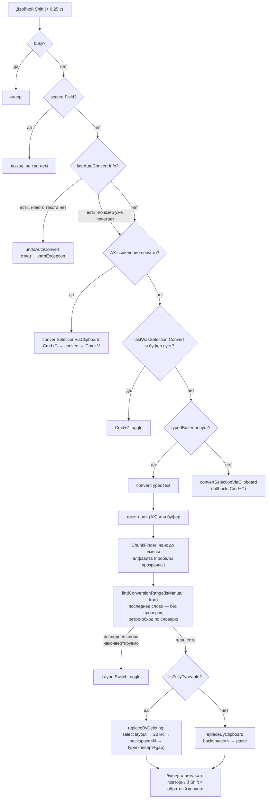
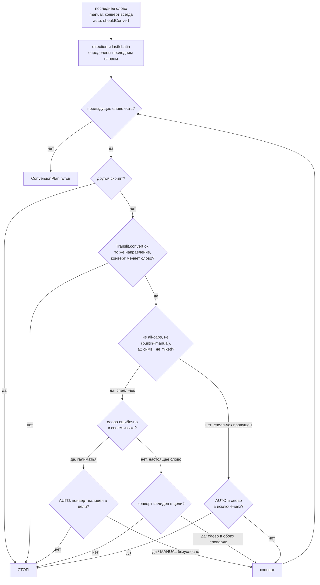
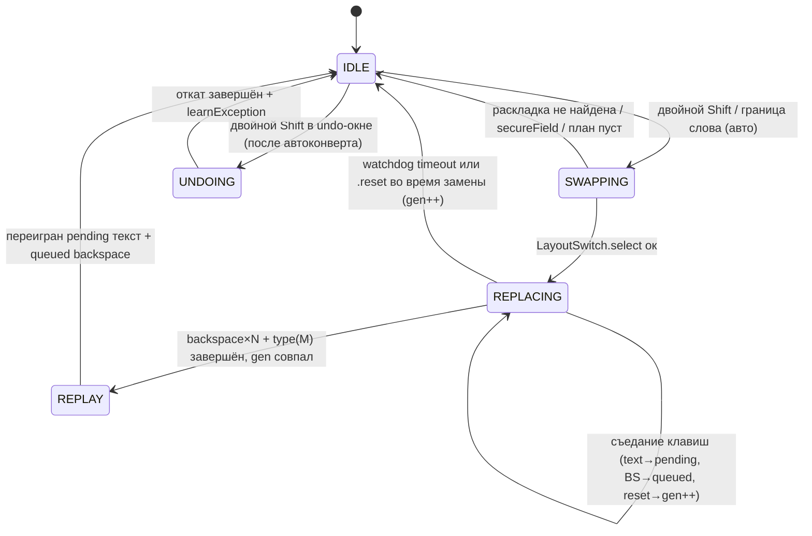

# AliSwitcher — Бизнес-логика конвертации

> **Статус**: актуальный справочник логики (source of truth для решений)
> **Дата**: 2026-09-07, код по коммиту `7cf0036` (PR #28, mac punctuation map)
> **Область**: автоконверт на границе слова, ручной двойной Shift, выбор диапазона,
> откат, словари/исключения, состояние, клавиатурный движок
> **Источники истины (код)**: `main.swift` (handle, tryAutoConvert, performSwitch,
> convertTypedText, convertSelectionViaClipboard, undoAutoConvert, replaceByDeleting,
> replaceByClipboard, trackTypedAction, replayPendingKeystrokes),
> `AutoSwitcher.swift` (findConversionRange, shouldConvert, evaluateAutoConvert,
> parseBufferSegments, builtins, exceptions), `Translit.swift` (карта, направление),
> `ChunkFinder.swift` (граница фрагмента), `KeyTracker.swift` (декодирование клавиш),
> `KeyEvents.swift` (постинг клавиш), `SwitcherState.swift` (состояние)

---

## Содержание

1. [ Big picture: два конвейера ](#1-big-picture)
2. [ Слой событий: handle() — все проверки по порядку ](#2-слой-событий)
3. [ Декодирование клавиш: KeyTracker ](#3-keytracker)
4. [ Буферизация: trackTypedAction ](#4-буферизация)
5. [ Детект двойного Shift ](#5-двойной-shift)
6. [ Автоконверт: tryAutoConvert ](#6-автоконверт)
7. [ Ручной свитч: performSwitch — приоритеты ](#7-performswitch)
8. [ Конверт набранного: convertTypedText + ChunkFinder ](#8-converttypedtext)
9. [ Ядро: findConversionRange — выбор диапазона ](#9-findconversionrange)
10. [ shouldConvert — фильтры слова-триггера ](#10-shouldconvert)
11. [ Ретро-обход: предыдущие слова ](#11-ретро-обход)
12. [ Конверт выделения через буфер ](#12-выделение)
13. [ Откат автоконверта: undoAutoConvert ](#13-откат)
14. [ Клавиатурный движок замены ](#14-движок)
15. [ Состояние (SwitcherState) ](#15-состояние)
16. [ Словари: builtins и исключения ](#16-словари)
17. [ Транслитерация: карта и направление ](#17-транслитерация)
18. [ Различия auto vs manual — сводная таблица ](#18-auto-vs-manual)
19. [ Диаграммы ](#19-диаграммы)
20. [ Известные компромиссы поведения ](#20-компромиссы)

---

<a name="1-big-picture"></a>
## 1. Big picture: два конвейера

У приложения два способа запустить конвертацию. Вся остальная машинерия общая.

```
                    ┌──────────────────────────────┐
                    │  CGEvent Tap (keyDown/flags) │
                    └──────────────┬───────────────┘
                                   │
              ┌────────────────────┼────────────────────────┐
              │                    │                        │
     [АВТО] граница слова   [БУФЕР] клавиши           [МАНУАЛ] двойной Shift
     space ! ? \n \t …        typedBuffer ≤500          <0.25 сек, press-release-press
              │                    │                        │
              ▼                    │                        ▼
      tryAutoConvert() ────да──────►│                performSwitch()
      evaluateAutoConvert()         │                 (приоритеты P0–P5)
      findConversionRange(          │                        │
        isManual: false)            │                        ▼
              │  нет ──► символ     │              буфер/выделение/откат
              │       проходит      │                 findConversionRange(
              ▼                     │                   isManual: true)
      replace: backspace×N          │                        │
      → LayoutSwitch.select         ▼                        ▼
      → type(конверт + граница)  (общий движок замены: replaceByDeleting / replaceByClipboard)
```

**Ключевая идея Punto-подхода**: приложение не знает «что юзер хотел набрать» —
оно знает, **какие физические клавиши нажимались** (буфер `typedBuffer`),
и по словарю угадывает, что набор шёл не в той раскладке. Затем: Backspace×N
(стереть набранное) → переключить раскладку → напечатать заново.

---

<a name="2-слой-событий"></a>
## 2. Слой событий: `handle()` — все проверки по порядку

Event tap перехватывает все `keyDown`, `flagsChanged`, клики мыши.
Порядок проверок в `handle()` жёсткий — каждая следующая опирается на предыдущую.

### 2.0. Сторожевой watchdog (выполняется ПЕРВЫМ, на каждом событии)

```
IF state.isReplacing:
    IF прошло > state.isReplacingTimeout (адаптивный):     ← см. §14.4
        — isReplacing = false, busy = false
        — pendingCharacters = "", pendingBackspaces = 0
        — generation += 1            ← инвалидировать все висящие колбэки
        (клавиатура больше не заблокирована; конвертация считается сорванной)
```

*Зачем*: если конвертация зависла (приложение-цель не съело синтетические
клавиши), без watchdog'а клавиатура блокируется навсегда (известный инцидент).

### 2.1. Оживление тапа

```
IF тип события == tapDisabledByTimeout | tapDisabledByUserInput:
    — повторно включить тап (CGEvent.tapEnable)
    — пропустить событие
```

### 2.2. keyDown — общий порядок

```
1) state.lastShiftPress = 0
   Любая клавиша сбрасывает счётчик двойного Shift (двойной Shift —
   строго два Shift подряд, без посторонних клавиш между ними).

2) IF идёт замена (isReplacing) И клавиша НЕ наша синтетическая:
      декодировать через KeyTracker.action(for:):
        .text(s)        → pendingCharacters += s; СЪЕСТЬ клавишу (return nil)
        .deleteBackward → если pendingCharacters не пуст: удалить последний
                          символ из буфера отложенного (съесть)
                          ИНАЧЕ: pendingBackspaces += 1 (съесть — переиграем позже)
        .reset          → pendingCharacters = "", pendingBackspaces = 0,
                          generation += 1   (клавишу ПРОПУСТИТЬ в приложение —
                          Enter/Tab/стрелки должны работать, клавиатура
                          не должна ощущаться мёртвой)
        .ignore         → пропустить в приложение (Escape, Fn, Cmd-комбинации
                          не влияют на позицию каретки)
   Зачем съедать: нажатия во время 0.15–0.5 с замены попали бы в «дырку»
   между backspace и перепечатыванием — текст разъехался бы.

3) IF lastWasSelectionConvert И клавиша реальная:
      lastWasSelectionConvert = false    ← первое нажатие после конверта
                                            выделения закрывает окно toggling'а

4) IF lastAutoConvertInfo != nil И клавиша реальная:
      lastAutoConvertInfo = nil           ← первое нажатие закрывает окно
                                             отката автоконверта (аналогично)

5) [АВТОРЕЖИМ — ворот из восьми условий, ВСЕ обязательны]:
   IF autoModeEnabled                    ← тумблер в меню (persist в UserDefaults)
   && !busy                              ← не идёт другая конвертация
   && !isReplacing                       ← не в середине замены
   && !secureField                       ← не поле пароля
   && !isSynthetic(event)                ← наши собственные клавиши не считаются
   && !ui.anyEditorVisible               ← окно редактора списков слов открыто
   && KeyTracker.action == .text(s), s.count == 1
   && AutoSwitcher.isBoundary(s)         ← универсальная граница (см. §6.1):
   THEN:
      IF tryAutoConvert(boundaryChar: s) == true:
          return nil        ← ЗАБЛОКИРОВАТЬ граничный символ; он будет
                             переигран как последний символ конверта
      ELSE:
          trackTypedAction(action)  ← символ в буфер, проходит в приложение
   ELSE (авто выключен и клавиша реальная):
      trackTyping(event)

6) Пропустить событие в приложение (return Unmanaged.passUnretained)
```

### 2.3. Клик мыши (leftMouseDown / rightMouseDown / otherMouseDown)

```
typedBuffer = ""                    ← фрагмент «потерян»: каретка могла уехать
secureField = false
lastWasSelectionConvert = false
lastAutoConvertInfo = nil
recentAutoConvertedWords — НЕ трогать!   ← приконверчённые пары нужны, чтобы
                                           юзер мог выделить результат автоконверта,
                                           дважды нажать Shift (реверс) и выучить
                                           исключение — данные должны пережить клик
```

### 2.4. flagsChanged — детект двойного Shift

См. §5.

---

<a name="3-keytracker"></a>
## 3. Декодирование клавиш: `KeyTracker.action(for:)`

Превращает CGEvent в семантическое действие. **Раскладка учитывается текущая**
(`UCKeyTranslate` по Unicode-data активного input source) — то есть в буфер
попадает то, что юзер реально НАБРАЛ на экране.

| keyCode | Действие |
|---|---|
| 36, 76 (Return/Enter) | `.reset` — фрагмент закончен, каретка ушла |
| 48 (Tab) | `.reset` |
| 51 (Backspace) | `.deleteBackward` |
| 53 (Escape) | `.ignore` |
| 115, 116, 119, 121 (Home/PageUp/End/PageDown) | `.reset` |
| 117 (ForwardDelete) | `.ignore` |
| 123–126 (стрелки) | `.reset` |
| Cmd/Ctrl зажаты | `.ignore` (копипастShortcut'ы — не текст) |
| остальное | UCKeyTranslate → `.text(символы_текущей_раскладки)` |

Нюанс реализации: UCKeyTranslate ожидает **классические** значения модификаторов
(shiftKey=2, cmdKey=16, alphaLock=256), а не константы текущего SDK — с ними
регистр игнорируется.

---

<a name="4-буферизация"></a>
## 4. Буферизация: `trackTypedAction`

`typedBuffer` — «что юзер набрал с последнего reset'а». Из него берутся слова
для автоконверта и для ручного convertTypedText (когда AX недоступен).

```
case .text(s):
    IF буфер пуст И secureField ещё не определён:
        secureField = AXIsSecureTextField(фокус)      ← ОДИН раз на фрагмент
    IF secureField: return                            ← в паролях буфер не ведём
    IF typedBufferIsFromConversion:                   ← буфер держал результат
        typedBuffer = ""; флаг = false               ← предыдущей конвертации
                                                      ← (для toggl'а). Новый набор
                                                      ← = новый фрагмент, старый
                                                      ← мусорить не должен
    буфер += s
    cap 500 символов (kMaxBufferLength)              ← защита от роста

case .deleteBackward:
    IF secureField: return
    IF typedBufferIsFromConversion:
        буфер = ""; флаг = false    ← правка конвертированного текста = буфер
                                     ← протух: физически стирается другое
    ELSE IF буфер не пуст:
        удалить последний символ    ← backspace синхронно укорачивает буфер

case .reset:   буфер = "", флаги сброс, secureField = false
case .ignore:  ничего
```

---

<a name="5-двойной-shift"></a>
## 5. Детект двойного Shift

В `flagsChanged` проходят только keycode 56 (левый Shift) и 60 (правый).

```
IF нажатие Shift:
    IF lastShiftPress != 0
    && now − lastShiftPress < 0.25 сек
    && lastShiftRelease > lastShiftPress:       ← между нажатиями был ОТЖАТИЯ
        ДВОЙНОЙ SHIFT:
            — съесть второе нажатие (return nil)
            — triggerSwitch()                   ← ручной свитч (см. §7)
    ELSE:
        lastShiftPress = now                    ← запомнить первое нажатие
IF отпускание:
    lastShiftRelease = now
```

Любая ДРУГАЯ клавиша между Shift'ами обнуляет `lastShiftPress` (см. §2.2 п.1) —
двойной Shift — строго два Shift подряд.

---

<a name="6-автоконверт"></a>
## 6. Автоконверт: `tryAutoConvert`

Запускается из handle() при вводе граничного символа (п.5 в §2.2).

### 6.1. Что считается границей (word boundary)

Только **универсальные** символы — одинаковые в обеих раскладках:

```
boundaries = { " ", "!", "?", "\n", "\t", "—", "–", "…" }
```

Почему НЕ точка/запятая: на мак-ЙЦУКЕН `.` — это `ю`, `,` — это `б` (БУКВЫ).
Точка внутри `htdm.` — это часть слова «ревью». Решение о границе буква/знак
делегировано спелл-чекеру.

### 6.2. Пошагово

```
1) guard !busy, !isReplacing                       ← повторный вход запрещён

2) plan = AutoSwitcher.evaluateAutoConvert(buffer, boundaryChar):
      a) segments = parseBufferSegments(buffer)    ← слова + гэпы (§9.1)
      b) последний сегмент, слово длиной ≥ 1       ← minWordLength = 1; защита
                                                     односимвольных слов — в
                                                     shouldConvert 4c (§10)
      c) plan = findConversionRange(buffer, isManual: false)
         └─ внутри: последнее слово обязано пройти shouldConvert (§10),
            предыдущие — ретро-обход (§11)
      d) вернул nil → авто-конверта нет

3) fullConvertedText = plan.convertedText + boundaryChar

4) busy = true
   isReplacingTimeout = computeIsReplacingTimeout(  ← адаптивный таймаут (§14.4)
       deleteCount: plan.deleteCount,
       textLength: fullConvertedText.count)
   isReplacing = true; запомнить момент старта
   gen = state.generation                          ← токен для колбэков (§15)

5) IF !LayoutSwitch.select(toRussian):             ← целевая раскладка RU/EN
      busy/isReplacing сбросить; return false
      (граничный символ ПРОЙДЁТ в приложение — апп не блокировал его)

6) typedBuffer = ""                                ← набранное сейчас сотрётся

7) пауза Timing.autoConvertDelay (20 мс)            ← дать раскладке примениться

8) KeyEvents.backspace(count: plan.deleteCount):
      deleteCount = originalText.count             ← БЕЗ граничного символа: он
                                                      физически ещё не в поле
   then KeyEvents.type(fullConvertedText):         ← конверт + граничный символ
      (граничный символ переигрывается как последний символ — иначе он
       остался бы на экране ДО стёртого слова)

9) По завершении (completion):
      isReplacing = false; busy = false
      guard state.generation == gen                 ← иначе колбэк протух — no-op
      replayPendingKeystrokes()                     ← добить съеденные клавиши (§14.5)
      lastAutoConvertInfo = (                       ← окно undo для СЛЕДУЮЩЕГО
          original: originalText + boundaryChar,    ← двойного Shift (§13)
          backspaceCount: fullConvertedText.count,
          undoToRussian: !toRussian,
          triggerWord)
      recentAutoConvertedWords += (triggerWord, convertedText)  ← пара для
          отложенного обучения исключениям при реверсе через выделение (§12)
          cap 20 пар (maxRecentAutoWords)
```

---

<a name="7-performswitch"></a>
## 7. Ручной свитч: `performSwitch` — приоритеты

```
triggerSwitch():
    guard !busy                       ← конвертация в полёте — игнор
    busy = true
    performSwitch() (async на main)

performSwitch():
    лог "switch: buffer «…»"

    P0. IF secureField → ВЫХОД (не трогаем пароли вообще)

    P1. IF lastAutoConvertInfo != nil (недавний автоконверт):
            hasNewText = в typedBuffer есть НЕ-граничный символ
            IF hasNewText:
                lastAutoConvertInfo = nil        ← юзер уже печатает новое —
                продолжить к P2                  ← хочет конверт, а не откат
            ELSE:
                undoAutoConvert(info)            ← двойной Shift сразу после
                ВЫХОД                             ← автоконверта = откат (§13)

    P2. IF AX-выделение непустое:
            convertSelectionViaClipboard()      ← работает даже при непустом буфере
            ВЫХОД

    P3. IF lastWasSelectionConvert && typedBuffer пуст:
            Cmd+Z (KeyEvents.undo)               ← toggle последнего конверта
            ВЫХОД                               ← выделения через undo системы

    P4. IF typedBuffer не пуст:
            convertTypedText()                  ← главный путь (§8)
            ВЫХОД

    P5. convertSelectionViaClipboard()          ← попытка достать выделение
                                                   через Cmd+C (AX мог промолчать);
                                                   внутри fallback → просто
                                                   LayoutSwitch.toggle()
```

---

<a name="8-converttypedtext"></a>
## 8. Конверт набранного: `convertTypedText` + ChunkFinder

### 8.1. Откуда берётся текст

```
IF AX доступен: realTextBeforeCaret()  ← ВЕСЬ текст поля до каретки (точный)
ИНАЧЕ:         state.typedBuffer        ← наш буфер (чат-клиенты, Electron и т.п.)
```

### 8.2. Граница фрагмента — `ChunkFinder.chunkStart`

Идём от каретки влево. Правила:

- первая встреченная БУКВА задаёт скрипт фрагмента (Cyrillic/Latin);
- пробелы, цифры, пунктуация — **прозрачны** (фраза «b yfgbcfk ytcrjkmrj ckjd»
  выбирается целиком, не по словам!);
- стоп: первая буква ДРУГОГО алфавита, либо `\n` / `\r` / `\t`;
- UTF-16 offsets — позиции не плывут (суррогатные пары пропускаются).

Пример: «привет ghbdtn», каретка в конце → чанк « ghbdtn».

### 8.3. Дальше

```
plan = findConversionRange(chunk, isManual: true)   ← §9
IF nil → LayoutSwitch.toggle()                      ← последнее слово
                                                      неконвертируемо — просто
                                                      сменим раскладку
fullText   = plan.convertedText + plan.lastGap     ← lastGap уже в поле (его
deleteCount = plan.deleteCount + lastGap.count       стираем и печатаем заново)
                                                    ← ОТЛИЧИЕ от авто: там граница
                                                      была заблокирована и её
                                                      в deleteCount нет
IF KeyEvents.isFullyTypeable(fullText, toRussian):  ← §14.3
    replaceByDeleting(fullText, deleteCount, toRussian)
ELSE:
    replaceByClipboard(fullText, deleteCount)      ← emoji/диакритика/смешанные
                                                      скрипты нельзя набрать
                                                      клавишами в одной раскладке
```

После завершения: `typedBuffer = fullText` (результат конвертации в буфере) +
`typedBufferIsFromConversion = true` → **повторный двойной Shift конвертит
обратно** (toggle). Начало нового набора очищает буфер (§4).

---

<a name="9-findconversionrange"></a>
## 9. Ядро: `findConversionRange` — выбор диапазона

Общая для auto и manual. Возвращает `ConversionPlan`:

| Поле | Смысл |
|---|---|
| `prefix` | текст ДО диапазона — остаётся в поле, не стирается |
| `originalText` | конвертируемые слова + гэпы МЕЖДУ ними |
| `convertedText` | то же после конвертации |
| `lastGap` | граничные символы ПОСЛЕ последнего слова |
| `deleteCount` | = `originalText.count` — сколько Backspace |
| `direction` | `.toCyrillic` / `.toLatin` — задаётся ПОСЛЕДНИМ словом |
| `triggerWord` | последнее слово |
| `wordCount` | сколько слов затронуто (последнее + ретро) |

### 9.1. Сегментация: `parseBufferSegments`

Буфер режется на пары (слово, гэп) по границам из §6.1.
`"f e ghbdtn"` → `[("f"," "), ("e"," "), ("ghbdtn","")]`.
Внутренние НЕ"]=$ • `.` `,` `;` остаются частью слов (см. §6.1).

### 9.2. Каркас

```
1) последнее слово (сегмент):
   manual → ВСЕГДА конвертируется (юзер явно попросил: никаких словарей)
   auto   → должно пройти shouldConvert (§10), иначе план = nil

2) direction = Translit.convert(последнее слово).direction
   lastIsLatin = isWordLatin(последнее слово)

3) ретро-обход от предпоследнего слова к началу чанка — §11
```

---

<a name="10-shouldconvert"></a>
## 10. `shouldConvert` — фильтры слова-триггера (только auto)

Вызывается ТОЛЬКО для последнего слова при автоконверте
(`isRetroactive: false`). Каждая ступень может вернуть `nil` = «не трогать»:

| # | Проверка | Зачем |
|---|---|---|
| 1 | `word.count ≥ minLength` (=1) | пустоту не проверяем |
| 2 | есть хоть одна буква | `123` `!!!` не слова |
| 3 | не ВСЕ-ЗАГЛАВНЫЕ (две+ буквы) | `HTML`, `API` — аббревиатуры |
| 4 | нет цифр | `iPhone15`, `3D` |
| 5 | нет `_` | `snake_case` идентификаторы |
| 6 | не матчит `nonConvertRegex` | URL (`http(s)://`, `www.`), email, IP, пути (`/usr`, `~/`), shell-переменные (`$HOME`), CLI-флаги (`-rf`), snake_case |
| 7 | `Translit.convert` дал результат И он отличается от оригинала | |
| 8 | **4a)** не builtin-слово | частотные коротышки: словарь их не знает, а юзер их печатает постоянно (`the`, `is`, `что`, `она`) |
| 9 | **4b)** не в выученных исключениях (`enWords`/`ruWords`) | юзер уже отменял конверт этого слова |
| 10 | **4c)** однобуквенное → конверт, только если результат — builtin | `d→в ✓`, `f→а ✓`, `Ш→I ✓`, `g→п ✗`, `q→й ✗` (обоа направления) |
| 11 | **4d)** смешанный алфавит (Cyrillic+Latin в одном слове) → конверт БЕЗ спелл-чека | смешанное слово всегда ошибка раскладки; NSSpellChecker такое не умеет |
| 12 | **(5)** origMisspelled: слово ошибочно в СВОЁМ языке (для слов ≥ 2) | правильное своё слово не трогаем |
| 13 | **(6)** convValid: конверт — настоящее слово в ЦЕЛЕВОМ языке (или матчит домен-regex `adguard.com` и т.п.) | конверт ради конверта не нужен |

---

<a name="11-ретро-обход"></a>
## 11. Ретро-обход: предыдущие слова

Идея: если юзер набрал не в той раскладке ОДНО слово — он, скорее всего, набрал
не в той раскладке и несколько ПРЕДЫДУЩИХ (не заметил же). Обход идёт от слова
перед триггером к началу чанка, слово за словом, и для каждого:

```
a) пустое слово → пропустить

b) другой скрипт (isWordLatin(prev) != lastIsLatin) → СТОП
   «привет ghbdtn» — цепочка только в одном алфавите

c) Translit.convert(prev) == nil
   || направление != направлению триггера
   || конверт не изменил слово                → СТОП

d) if НЕ (все-заглавные)                      ← ЕРФТЛ→THANK: NSSpellChecker
   && НЕ (builtin-слово && manual)               считает аббревиатуры валидными
   && слово ≥ 2 символов
   && НЕ смешанный алфавит:
   идёт спелл-чек:
      origMisspelled = слово ошибочно в СВОЁМ языке
      ├─ origMisspelled == true (галиматья):
      │    AUTO   → конверт обязан быть валиден в целевом (или домен) → иначе СТОП
      │    MANUAL → конверт БЕЗУСЛОВНО (юзер сам попросил)     ← см. §20.1!
      └─ origMisspelled == false (настоящее слово):
           конверт валиден в целевом? (или домен)
           ├─ ДА  → слово существует в ОБОИХ словарях → КОНВЕРТИМ
           │        (приоритет направления: EN→RU → русское выигрывает)
           └─ НЕТ → слово подлинно своё → СТОП
           («vs»→«мы» оба валидны → конвертим; «by»→«ин» «ин» не слово → стоп)

e) исключения (enWords/ruWords):
   AUTO   → слово в списке → СТОП
   MANUAL → ИГНОРИРУЮТСЯ (юзер явно попросил конверт)      ← см. §20.1

f) конверт слова → prepend к convertedText → следующее слово
```

**Отличия builtin-слов в ретро** (PR #25):
- AUTO: builtin идёт через спелл-чек (`origMisspelled` стопает на валидных
  «это», «из») — иначе «это из сдд» конвертилось тремя словами;
- MANUAL: builtin обходит спелл-чек (юзер попросил — конвертим).

---

<a name="12-выделение"></a>
## 12. Конверт выделения через буфер

`convertSelectionViaClipboard()`. Путь P2/P5 из §7.

```
1) guard !isReplacing                             ← не во время другой замены
2) isReplacingTimeout = 1.5 c (минимум;           ← размер замены неизвестен
   конверт через Cmd+V мгновенный — запас не нужен)
3) snapshot клипборда (данные, не NSPasteboardItem —            ← краш-урок:
   writeObjects со старыми ссылками = NSException)                см. память)
4) IF P2 (AX-выделение уже известно): текст = выделение
   IF P5 (fallback): PressCmd+C → пауза 150 мс (clipboardWait)
      → текст из буфера обмена (changeCount должен измениться)
5) IF текст пуст / Translit.convert неуспешен / конверт == оригинал:
      восстановить клипборд; LayoutSwitch.toggle()             ← просто смена
      (и replayPendingKeystrokes)                                раскладки
6) ОБУЧЕНИЕ ИСКЛЮЧЕНИЯМ: если текст/конверт совпадает с парой из
   recentAutoConvertedWords (в любую сторону) — юзер выделил и реверсирует
   автоконверт → learnException(триггерное слово) для каждой пары
7) lastWasSelectionConvert = true                 ← вход для P3 (Cmd+Z toggle)
8) LayoutSwitch.select(по направлению конверта)
9) Clipboard.copy(конверт); PressCmd+V
10) пауза 400 мс (clipboardRestore) → восстановить клипборд
11) isReplacing=false, busy=false, generation-check, typedBuffer="" (очистить!)
```

---

<a name="13-откат"></a>
## 13. Откат автоконверта: `undoAutoConvert`

Срабатывает по P1 из §7: двойной Shift **сразу после** автоконверта, пока юзер
не успел ничего напечатать (`lastAutoConvertInfo != nil` и в буфере нет
не-граничных символов — любой реальный keyDown эту информацию стирает, §2.2 п.4).

```
1) LayoutSwitch.select(обратное направление):
   FAIL → busy=false, ВЫХОД                        ← раскладку не нашли — откат
                                                      не состоится, ИСКЛЮЧЕНИЕ
                                                      НЕ УЧИТСЯ (BUG #3 fix:
                                                      learning — ПОСЛЕ гварда)
2) IF autoLearnExceptions (тумблер в меню, по умолчанию ON):
      learnException(triggerWord)                 ← добавит в enWords/ruWords
                                                      (по алфавиту слова);
                                                      заистрённое слово больше
                                                      НИКОГДА не автоконвертится
3) адаптивный таймаут, isReplacing=true, gen=captured
4) пауза 50 мс (layoutSwitchDelay)
5) backspace(backspaceCount) → type(original)     ← вернуть как было
6) completion: isReplacing=false, busy=false,
   generation-check, replayPendingKeystrokes
```

Обучение срабатывает и через реверс выделением (§12 п.6) — там проверяются
`recentAutoConvertedWords` (компенсация того, что между автоконвертом и реверсом
юзер мог кликнуть мышью, а клик стирает `lastAutoConvertInfo`).

---

<a name="14-движок"></a>
## 14. Клавиатурный движок замены

### 14.1. `replaceByDeleting` — основной путь

```
1) guard !isReplacing
2) LayoutSwitch.select(toRussian) — FAIL → ВЫХОД (текст не трогаем)
3) адаптивный таймаут; isReplacing=true; gen=captured
4) пауза Timing.autoConvertDelay (20 мс)         ← PR #26: без неё первый
                                                     Backspace терялся
                                                     (Spotlight и системные поля)
5) backspace(deleteCount) — по 8 мс на клавишу
6) type(text):
   - пауза 50 мс (layoutSwitchDelay) — дать раскладке примениться
   - по 10 мс на символ
   - для toRussian: символ → QWERTY-клавиша через Translit.enOnSameKey
7) completion: isReplacing=false; busy=false;
   generation-check;
   typedBuffer = результат; typedBufferIsFromConversion = true   ← toggle
   lastWasSelectionConvert = false
   replayPendingKeystrokes()
```

### 14.2. `replaceByClipboard` — когда клавишами не набрать

Backspace×N → `Clipboard.copy(текст)` → Cmd+V → 400 мс → restore клипборда.
Используется при смешанных скриптах/emoji: `isFullyTypeable` = false.

### 14.3. `isFullyTypeable` — можно ли набрать клавишами

- каждая буква ∈ кириллица при toRussian (найдём её QWERTY-клавишу через
  `enOnSameKey`) либо ∈ латиница при toLatin;
- каждый НЕ-буквенный символ есть в QWERTY-карте (пробел, цифры, пунктуация);
- иначе — латинская буква в русском наборе/кириллица в английском/emoji → false.

### 14.4. Адаптивный таймаут `computeIsReplacingTimeout`

```
expected = deleteCount × 8 мс + textLength × 10 мс + 50 мс
timeout  = max(1.5 сек, expected + 0.5 сек)
```

Малые конверты — 1.5 с; большие (96 backspace + 90 символов ≈ 1.67 с) —
пропорциональный запас + 0.5 с. Инцидент: фиксированные 1.5 с сорвали крупный
конверт force-reset'ом на середине.

### 14.5. `replayPendingKeystrokes` — переиграть съеденное

Клавиши, съеденные во время isReplacing (§2.2 п.2): сначала текст
(`pendingCharacters`, через `KeyEvents.replay` — без стартовой паузы), затем
backspace'ы (`pendingBackspaces`). Переигранное попадает и в буфер
(`trackTypedAction`).

---

<a name="15-состояние"></a>
## 15. Состояние (`SwitcherState`)

| Поле | Тип | Кто пишет | Смысл |
|---|---|---|---|
| `busy` | Bool | все пути | одна конвертация одновременно; сброс в КАЖДОМ выходе |
| `isReplacing` (+`Since`, +`Timeout`) | Bool/Time | движок замены | идёт backspace/type-цепочка; watchdog следит за таймаутом |
| `typedBuffer` | String ≤500 | trackTypedAction | набранный фрагмент |
| `typedBufferIsFromConversion` | Bool | движок | буфер = результат конверта (для toggl'а); новый набор/Backspace чистят |
| `generation` | UInt64 | force-reset, `.reset` при isReplacing | токен асинхронности: колбэк обязан свериться, иначе no-op (BUG #4/#5) |
| `pendingCharacters` / `pendingBackspaces` | String/Int | handle при isReplacing | съеденные клавиши → replay |
| `lastAutoConvertInfo` | Info? | автоконверт | окно undo; стирается ЛЮБЫМ реальным keyDown или кликом |
| `recentAutoConvertedWords` | [(orig,conv)] ≤20 | автоконверт | пары для обучения при реверсе выделением; переживает клик |
| `lastWasSelectionConvert` | Bool | §12 | окно Cmd+Z-toggle |
| `secureField` | Bool | trackTypedAction | пароли: не буферизуем, не конвертим |
| `autoModeEnabled` | Bool (UserDefaults) | меню | тумблер авто |
| `autoLearnExceptions` | Bool (UserDefaults) = true | меню | обучение на откате |
| `enWords` / `ruWords` | Set<String> | learnException, редакторы списков | исключения по алфавиту слова |

Правило `busy`: НЕЛЬЗЯ `defer { busy = false }` — асинхронные пути живут дольше
функции (урок задокументирован в `/memories/repo/ali-switcher-huge-fuckup-toggle.md`).

---

<a name="16-словари"></a>
## 16. Словари: builtins и исключения

### Builtins (встраиваемые)

`builtin_words_en.txt` (109 слов) и `builtin_words_ru.txt` (80) в бандле:
частотные слова 1–3 символа, которые NSSpellChecker считает «валидными».
`isBuiltinWord` регистронезависим (lowercase перед lookup), маршрут по алфавиту.
**Не хардкодить в Swift** — только txt-файлы.

Применение:
- авто-триггер: шаг 4a — блокируют конверт (§10);
- авто-триггер, однобуквенное: шаг 4c — РЕЗУЛЬТАТ должен быть builtin;
- ретро AUTO: идут через спелл-чек (§11);
- ретро MANUAL: обходят спелл-чек.

### Исключения (выученные)

Два независимых `Set<String>`: `enWords` (латиница → блокируют Латиница→Русский)
и `ruWords` (кириллица → блокируют Русский→Латинский). Направление неявно —
из алфавита слова. Пары/словари/обратное блокирование — НЕТ.

Пишутся при: `undoAutoConvert` (обратный двойной Shift), реверсе автоконверта
через выделение (§12 п.6). `learnException` маршрутизирует слово в нужный список по алфавиту.

**Manual-режим исключения игнорирует** (§11 e).

---

<a name="17-транслитерация"></a>
## 17. Транслитерация: карта и направление

`Translit.ruToEn` — соответствие «русская буква ↔ символ на той же физической
клавише». Буквы совпадают с Windows ЙЦУКЕН. **Пунктуация — МАК-карта**
(`com.apple.keylayout.Russian`, проверено дампом UCKeyTranslate, PR #28):

| RU | EN | клавиша |
|---|---|---|
| `№` | `#` | Shift+3 |
| `"` | `@` | Shift+2 |
| `%` | `$` | Shift+4 |
| `:` | `%` | Shift+5 |
| `,` | `^` | Shift+6 |
| `.` | `&` | Shift+7 |
| `;` | `*` | Shift+8 |
| `?` | `?` | Shift+44 — универсальный |
| `/` | `/` | 44 — универсальный |

Направление определяется в `Translit.convert`:

- чистый скрипт → в противоположный (кириллица → латиница);
- СМЕШАННЫЕ слова (Cyrillic+Latin в одном слове): **первая буква** задаёт
  «правильную» раскладку, конвертируется меньшинство: «любыхk» → «любыхл»
  (первая «л» кириллица → k-хвост конвертится в «л», НЕ «любых» → «k.,s[»);
- нет букв вовсе, но есть символы из карты → маппим по первому найденному;
- типографические кавычки `«»` нормализуются в ASCII до lookup'а (Smart Quotes).

---

<a name="18-auto-vs-manual"></a>
## 18. Различия auto vs manual — сводная таблица

| Аспект | Автоконверт (граница слова) | Ручной (двойной Shift) |
|---|---|---|
| Ворота | 8 условий handle() (§2.2 п.5) | busy + характер Shift-нажатий (§5) |
| Вход в findConversionRange | `isManual: false` | `isManual: true` |
| Последнее слово | должно пройти `shouldConvert` (13 фильтров, §10) | конвертируется ВСЕГДА, без проверок |
| Однобуквенный триггер | только если конверт — builtin | без ограничений |
| Ретро: «галиматья» (origMisspelled) | требует валидный конверт в цели | конвертит безусловно |
| Ретро: builtin | через спелл-чек | обходит спелл-чек |
| Ретро: выученные исключения | блокируют | игнорируются |
| Граница после слова | блокируется и переигрывается в тексте | уже в поле: входит в deleteCount и fullText |
| Undo | следующий двойной Shift = откат (`lastAutoConvertInfo`) | повторный двойной Shift = обратный конверт (буфер) |
| Обучение исключениям | да (откат/реверс выделением) | нет (ручная конвертация ничего не учит) |
| Селекция | — (не участвует) | P2: AX-выделение → клипборд |
| Fallback при нечего конвертить | граничный символ просто проходит | LayoutSwitch.toggle() |

---

<a name="19-диаграммы"></a>
## 19. Диаграммы

### 19.1. Ручной двойной Shift (performSwitch + convertTypedText)



### 19.2. Автоконверт

```mermaid
flowchart TD
    A["keyDown: text(s), s — граница<br/>(space ! ? \\n \\t — —)" --> B{"auto Mode &&<br/>!busy && !isReplacing &&<br/>!secureField && !synthetic &&<br/>!anyEditorVisible?"}
    B -- "нет" --> Z["символ в буфер,<br/>проходит в приложение"]
    B -- "да" --> C["evaluateAutoConvert:<br/>parseBufferSegments →<br/>findConversionRange(isManual: false)"]
    C -- "плана нет<br/>(последнее слово не прошло<br/>shouldConvert)" --> Z
    C -- "план есть" --> D{"LayoutSwitch.select<br/>нашёл целевую раскладку?"}
    D -- "нет" --> Z
    D -- "да" --> E["блокируем символ (return nil)<br/>typedBuffer = ''"]
    E --> F["20 мс → backspace×deleteCount<br/>→ type(converte + символ)"]
    F --> G["completion:<br/>gen-check → replay съеденного"]
    G --> H["lastAutoConvertInfo = (undo-окно)<br/>recentAutoConvertedWords += пара"]
    H --> I["юзер печатает дальше?"]
    I -- "реальный keyDown" --> J["undo-окно закрыто"]
    I -- "двойной Shift" --> K["undoAutoConvert:<br/>обратный конверт +<br/>learnException(слово)"]
```

### 19.3. Ретро-обход (внутри findConversionRange)



### 19.4. Состояния (обновлённая версия Appendix A из DESIGN-conversion-logic.md)



---

<a name="20-компромиссы"></a>
## 20. Известные компромиссы поведения

### 20.1. Ручной ретро-обход портит технические заимствования

**Симптом** (2026-09-06, лог): юзер набрал «…можно репозиторий» верно по-русски,
затем хотел «find», но не переключил раскладку → «аштв». Двойной Shift починил
«аштв»→«find», но заодно исказил правильное «репозиторий» → «htgjpbnjhbq».

**Причина**: системный словарь macOS НЕ знает «репозиторий» (проверено
NSSpellChecker: misspelled=true; аналогично «коммит», «деплой», «инпуте»).
В ретро-обходе MANUAL «галиматья в своём языке» конвертится безусловно (§11 d),
а исключения в manual игнорируются (§11 e).

**Обсуждаемые варианты** (решение не принято, задокументировано 2026-09-07):
1. Требовать `convValid` для «галиматьи» и в manual (как в auto) + уважать
   исключения в manual-ретро — спасает заимствования сразу, но цепочка стопится
   на «мусорных» словах (частичный фикс фразы).
2. Только уважение исключений + обучение на откате manual-конверта — мягче,
   но первое попадание каждого нового слова всё равно портит текст.

### 20.2. Ретро-цепочка останавливается на первом «своём» слове

По дизайну: «есть термин АГВ» — если «термин» валиден в RU, а его конверт
невалиден в EN — обход стопится, конвертируется только хвост. Это защита от
порчи правильного текста (см. §11 п.d).

### 20.3. Системный словарь — единственный арбитр валидности

Все решения «слово/не слово» — NSSpellChecker. Слова, которых нет в словаре
(заимствования, сленг, имена), могут конвертироваться ошибочно (§20.1) или
блокировать конверт («ксли» не словарное — цепочка стопится). Компенсация:
builtin-списки (только короткие частотники) + выученные исключения.
